# BipedalWalkerHardcore-v3 · TD3

딥러닝기초 팀 프로젝트. TD3(Twin Delayed DDPG) 하나로 서로 다른 설정 5개를 실험해 BipedalWalkerHardcore-v3를 풀었다.

## 프로젝트 소개

과제: BipedalWalkerHardcore-v3. 계단·구덩이·그루터기가 매 에피소드 절차적으로 생성되는 4관절 연속제어.

기본 설정(ReLU, fall_penalty=-100) 결과: 2000ep까지 `avg_reward_100` 130 부근 정체.

| 단계 | 조치 | 결과 |
|---|---|---|
| 1 | ReLU → GELU, `frame_skip=2`, `fall_penalty=-100 → -10` | 300점 근처에서 재정체 |
| 2 | `final_layer_init_scale=0.003` + `critic_output_scale=10` 추가 | 모델2·모델3 `avg_reward_100` 300 돌파 |
| 3 | 모델2·모델3 파인튜닝 + 트릭 없이 speed shaping만 적용한 대조군 병렬 실험 | 모델1(안정성 1위), 모델4(최속 학습, 재현성 미검증) 확보 |
| 4 | 공격적 speed shaping 실험(모델5) | 해결률·낙상률·클리어속도 3개 지표 모두 악화 |

결과: 5개 레시피 전부 solve 기준(`avg_reward_100 ≥ 300`) 달성. 낙상률 최저인 모델1을 최종 후보로 선정(걸음 품질만 보면 모델2가 상위, 아래 표).

**5개는 정확히 5번만 실행해서 나온 결과가 아니다.** 위 표의 2단계에서 먼저 검증한 단일 안정화 레시피(GELU + `frame_skip=2` + `fall_penalty=-10` + `final_layer_init_scale=0.003` + `critic_output_scale=10`)를 기준으로 한 축씩 바꿔가며(파인튜닝 여부, LayerNorm 유무, speed shaping 유무·강도, 시드) 여러 런을 실행했고, 그중 수렴한 런만 5개 모델로 남겼다. 예: 모델4 재현성 검증차 시드만 바꿔 돌린 `g2-ns-replicate-s601`은 2000ep 내 미수렴, 별도로 돌리던 파인튜닝 실험 `g2-si-symlr-s401`은 체크포인트 저장 버그로 기록이 누락돼 제외했다(둘 다 5개 모델에는 포함하지 않음). 무작위 조합을 대량으로 돌려 잘 된 것만 고른 게 아니라, 통제 변수 실험 중 수렴에 실패한 런이 자연스럽게 걸러진 것이다.

**"5개 다 성공"도 정확한 표현은 아니다.** 학습 중 solve 기준(`avg_reward_100 ≥ 300`)은 5개 모두 통과했지만, 100ep 재평가(아래 [핵심 결과](#결과))에서 모델5는 해결률 29%로 사실상 실패, 모델4는 재현성이 확인되지 않았다. 이 두 모델은 "반면교사"·"재현성 미검증"으로 아래 표에 그대로 남겨뒀다.

추가 검증 항목:

- 주장: 안정화 트릭은 많을수록 낫다. 검증: 트릭 4개(모델3) vs 트릭 2개(모델2) 비교. 결과: 해결률 80% vs 82%, 비낙상 평균 307.20 vs 310.96 — 반증.
- 주장: 학습 reward와 평가 reward는 같다. 검증: 모델4를 speed shaping 보너스 포함/제외로 재측정. 결과: 해결률 82% → 67% — 반증, 보너스 유무에 따라 15%p 차이.
- 주장: `speed_high_thresh`를 낮추고 bonus/penalty를 키우면 더 빨리 클리어한다. 검증: 모델5(0.3→0.25, bonus·penalty 확대). 결과: 해결률 29%·낙상률 20%·클리어 532.5step, 5개 모델 중 3개 지표 전부 최저 — 반증.
- 발견: 체크포인트 저장 버그. 파인튜닝 초반 탐험 노이즈로 우연히 300점대 에피소드가 나오면 "최고기록"으로 저장되어 이후 갱신이 멈춘다. 근거: 별도 실험 `g2-si-symlr-s401`에서 실제 300점 돌파에도 체크포인트 미갱신 확인. 조치: 100 에피소드 윈도우가 다 찰 때까지 신기록 갱신 대상에서 제외.

## 문제 정의와 알고리즘 선택

State: 24차원(몸통 각도·각속도, x/y 속도, 4관절×2 각도/각속도, 발 접촉 플래그 2, 라이다 10).
Action: 4차원 [-1,1](양다리 고관절·무릎 토크).
Reward: 전진거리 비례 보상 − 모터 사용 패널티 − 낙상 패널티(기본 -100, 적용값 -10).

선택 기준: 연속 행동 → DQN 계열 제외. 표본 재사용 필요 → on-policy(PPO/A2C) 제외. 남은 off-policy 후보 중 TD3 채택.

TD3의 과대평가 억제 메커니즘 3가지:

| 메커니즘 | 내용 |
|---|---|
| Twin Critic (Clipped Double-Q) | Critic 2개(`critic1`, `critic2`), 타겟 계산에 `min(Q1, Q2)` 사용 |
| Delayed Policy Update | Critic은 매 스텝, Actor는 `policy_delay=2`스텝마다 업데이트 |
| Target Policy Smoothing | 타겟 행동에 클리핑 노이즈(`policy_noise=0.2`, `noise_clip=0.5`) 추가 |

## 설치 및 실행 (Colab 기준)

로컬 GPU 없이 Google Colab에서 그대로 재현할 수 있다. `--play`(시연/녹화)는 pygame `render_mode="human"` 창을 띄우는 방식이라, 디스플레이가 없는 Colab에서는 가상 디스플레이(xvfb)가 필요하다. 학습(`run_train.sh`)과 100ep 재평가(`run_eval100.sh`)는 렌더링을 안 하므로 가상 디스플레이 없이 바로 된다.

### 1) 저장소 준비 + 의존성 설치

```bash
%cd /content
!apt-get update -qq && apt-get install -y xvfb > /dev/null
!pip install -q pyvirtualdisplay
!pip install -q -r bipedalwalker-td3/requirements.txt
```

의존성: torch, gymnasium[box2d], pygame(렌더링/HUD), imageio+imageio-ffmpeg(영상 녹화), matplotlib(그래프).

### 2) 가상 디스플레이 시작 (세션당 한 번, `--play` 쓸 때만 필요)

```python
from pyvirtualdisplay import Display
display = Display(visible=0, size=(1400, 900))
display.start()
```

### 3) 시연 + 녹화

`run_play.sh` 기본값에는 `video_record_dir`이 없어서 mp4로 안 남는다. 녹화하려면 python 커맨드를 직접 호출하며 `video_record_dir`을 추가로 지정한다.

```bash
%cd bipedalwalker-td3/models/model1_g2-si-speed-s201
!python3 ../../src/Bipedalwalker_TD3_live.py --play 3 --ckpt ep794 --set \
  run_tag=g2-si-speed-s201 hardcore=true frame_skip=2 fall_penalty=-10.0 \
  activation=gelu final_layer_init_scale=0.003 critic_output_scale=10.0 \
  video_record_dir=/content/demo_videos
```

```python
# 녹화된 영상 확인(Colab 셀에서 바로 재생) / 다운로드
from IPython.display import Video
Video("/content/demo_videos/g2-si-speed-s201_ep1.mp4", embed=True)

from google.colab import files
files.download("/content/demo_videos/g2-si-speed-s201_ep1.mp4")
```

다른 모델은 `--ckpt`와 `--set`의 `run_tag`·트릭 값만 해당 모델 폴더의 `run_train.sh`에 있는 값으로 바꾸면 된다.

### 4) 학습 재현

```bash
%cd bipedalwalker-td3/models/model1_g2-si-speed-s201
!bash run_train.sh   # 부모 체크포인트가 필요하면 폴더 안 README 참고
```

### 5) 100ep 고정시드 재평가 (해결률·낙상률 표 재현)

```bash
!bash run_eval100.sh
```

파이프라인 코드(`src/Bipedalwalker_TD3_live.py`, `src/evaluate_100ep.py`)는 5개 모델이 공유. 각 모델 폴더에는 체크포인트와 실행 스크립트만 있음.

공통 하이퍼파라미터(Config 기본값):

| 항목 | 값 |
|---|---|
| gamma (할인율) | 0.99 |
| tau (soft target update) | 0.005 |
| actor_lr / critic_lr | 1e-4 / 1e-3 |
| policy_noise / noise_clip | 0.2 / 0.5 |
| policy_delay | 2 |
| batch_size | 128 |
| hidden_dim / num_hidden_layers | 256 / 2 |

모델별 상이값(frame_skip, fall_penalty, activation, speed shaping 등)은 각 모델 폴더의 `run_train.sh`, `README.md`에 기록.

### 로컬에서 채크포인트를 실행할 경우

pygame 창이 화면에 그대로 뜨므로 가상 디스플레이가 필요 없다.

```bash
pip install -r bipedalwalker-td3/requirements.txt
cd bipedalwalker-td3/models/model1_g2-si-speed-s201
./run_play.sh      # 로컬 재생, HUD로 모델명 표시
./run_train.sh     # 학습 재현
./run_eval100.sh   # 100ep 고정시드 재평가
```

## 결과

측정 조건: `noise_std=0`, 고정 시드 9000–9099, frame_skip/fall_penalty 래퍼 유지, speed-shaping 보너스 제외.

| 모델 | 학습 방식 | 해결률 | 낙상률 | 비낙상 평균 | 클리어 step |
|:---:|:---|:---:|:---:|:---:|:---:|
| **모델1** `g2-si-speed-s201` | 파인튜닝 794ep (모델2 기반) | **83%** | **12%** | 304.73 | 502.6 |
| 모델2 `scratch-initscale` | from scratch 3081ep | 82% | 18% | **310.96** | 482.3 |
| 모델3 `scratch-fulltrick-speed` | from scratch 2778ep | 80% | 18% | 307.20 | **477.0** |
| 모델4 `new-speed-s102` | from scratch 1556ep | 67% | 19% | 303.21 | 492.9 |
| 모델5 `g2-si-fastclear-s501` | 파인튜닝 843ep (모델2 기반) | 29% | 20% | 298.29 | 532.5 |

모델1·모델5의 episode 수(794ep, 843ep)는 파인튜닝 시작 시점부터 0으로 다시 센 값 — 부모 모델(모델2)이 이미 학습한 3081ep는 포함하지 않음.

기준별 1위: 안정성(낙상률) 모델1, 걸음 품질 모델2, 클리어 속도 모델3.

모델4: 재현 실험(동일 레시피, 시드 변경)이 2000ep 내 미수렴 — 재현성 미확인.
모델5: 배포 제외, 반면교사 사례로 보관.

최종 후보: 모델1. 근거: 해결률 차이(83% vs 82%, 1episode)는 통계적 의미가 작고, 낙상률 차이(12% vs 18%, 6episode)가 더 뚜렷하다.

## 수렴 곡선

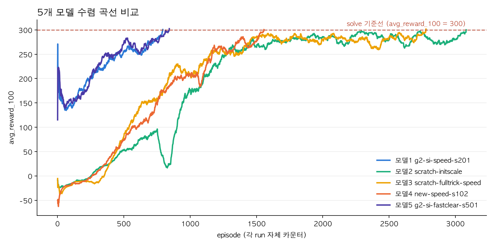

파인튜닝 모델(모델1·모델5): 부모 체크포인트에서 가중치만 승계, 옵티마이저·리플레이 버퍼는 새로 초기화 — 그래프 초반 성능 변동 구간 발생. x축(episode)은 파인튜닝 시작부터 다시 0으로 센 값이며 부모 모델의 3081ep는 포함하지 않음.

모델별 reward curve / loss curve는 아래 표.

<table>
<tr><td align="center"><b>모델1</b></td><td align="center"><b>모델2</b></td></tr>
<tr>
<td>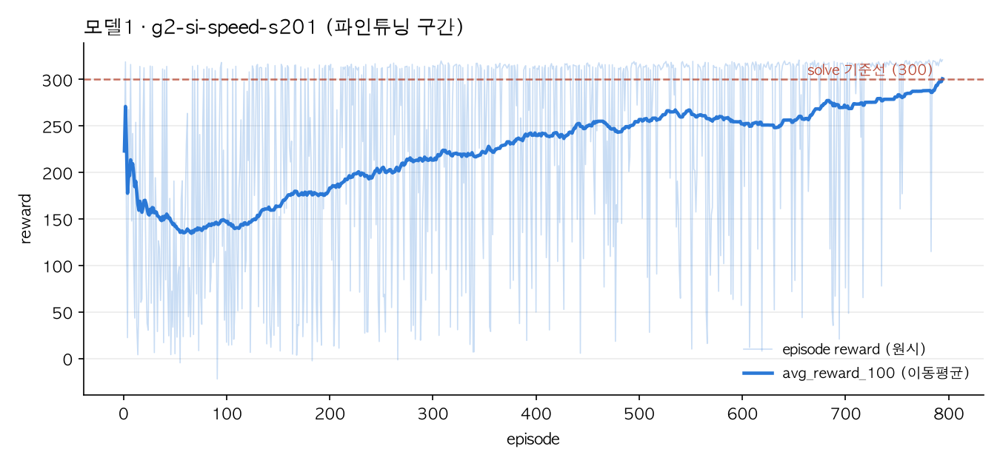</td>
<td>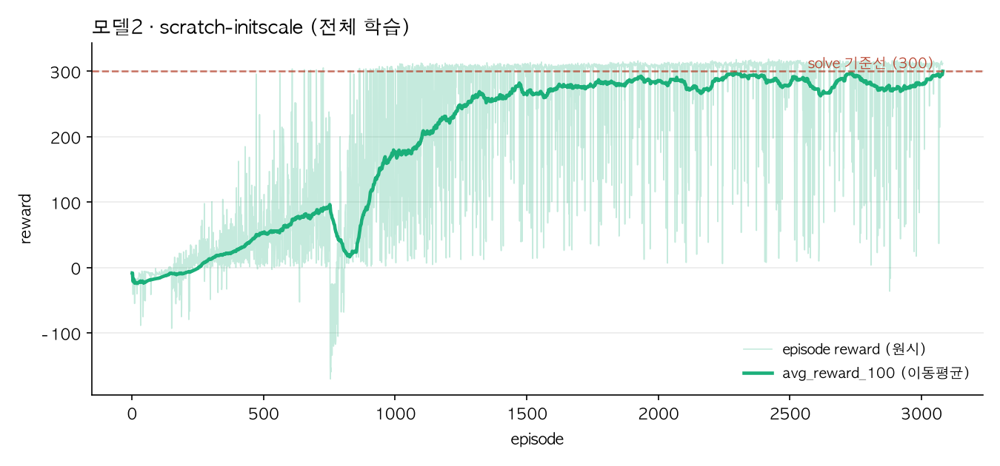</td>
</tr>
<tr><td align="center"><b>모델3</b></td><td align="center"><b>모델4</b></td></tr>
<tr>
<td>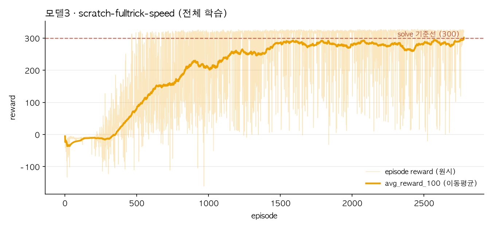</td>
<td>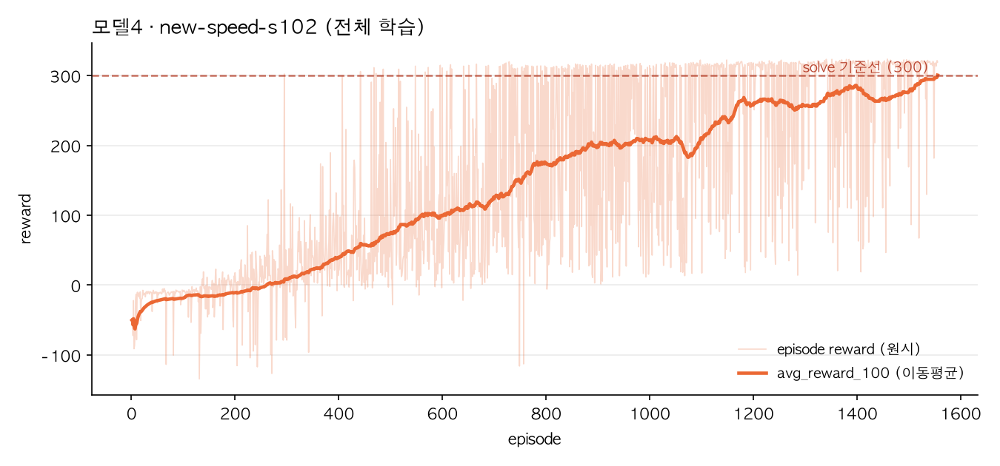</td>
</tr>
<tr><td align="center"><b>모델5</b></td><td></td></tr>
<tr>
<td>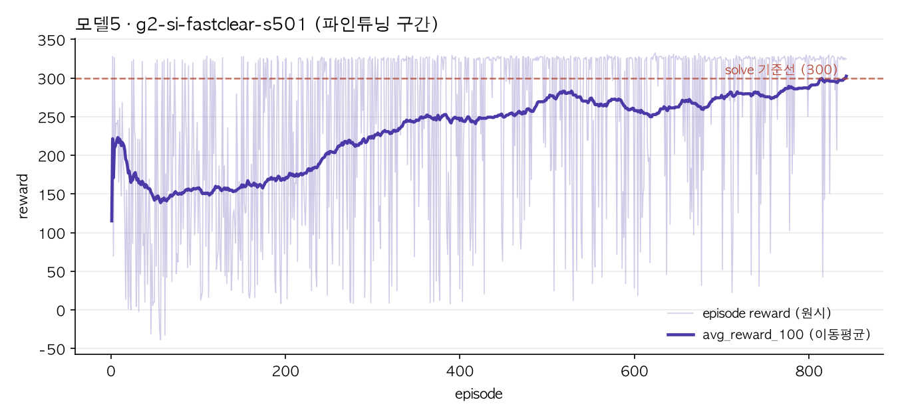</td>
<td></td>
</tr>
</table>

`loss_curve.png`: 체크포인트에서 150ep 이어학습하며 로깅한 critic/actor loss. 학습 당시 loss 미기록 — 재현 학습으로 얻은 그래프.

## 시연 영상

`results/videos/model{N}_{run_tag}/`에 mp4 3개, HUD에 모델명 표시.

<table>
<tr>
<td align="center"><b>모델1</b><br><sub>최종 후보 · 낙상률 12%</sub></td>
<td align="center"><b>모델2</b><br><sub>걸음 품질 1위</sub></td>
<td align="center"><b>모델3</b><br><sub>클리어 속도 1위</sub></td>
</tr>
<tr>
<td>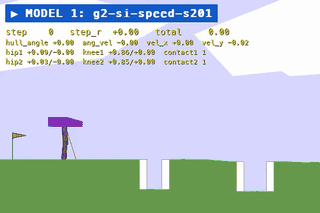</td>
<td>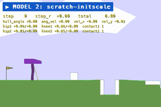</td>
<td>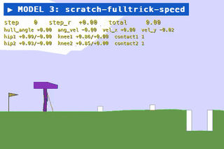</td>
</tr>
<tr>
<td align="center"><b>모델4</b><br><sub>학습 비용 최저 · 재현성 미검증</sub></td>
<td align="center"><b>모델5</b><br><sub>반면교사 사례</sub></td>
<td></td>
</tr>
<tr>
<td>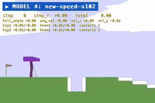</td>
<td>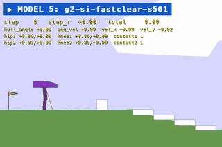</td>
<td></td>
</tr>
</table>

## 보고서

| 문서 | 링크 |
|---|---|
| 모델1~5 개별 보고서 | [모델1](bipedalwalker-td3/reports/model1_report.pdf) · [모델2](bipedalwalker-td3/reports/model2_report.pdf) · [모델3](bipedalwalker-td3/reports/model3_report.pdf) · [모델4](bipedalwalker-td3/reports/model4_report.pdf) · [모델5](bipedalwalker-td3/reports/model5_report.pdf) |
| 추가 실험 자료 | [활성화함수 ablation](bipedalwalker-td3/reports/activation_ablation_flat_report.pdf) · [알고리즘 비교(TD3 vs SAC/PPO/DDPG)](bipedalwalker-td3/reports/algo_comparison_td3_sac_ppo_ddpg.pdf) |
| 알고리즘 비교 원본 데이터 + 검증 스크립트 | [reports/figures/](bipedalwalker-td3/reports/figures) |

## 폴더 구조

```
bipedalwalker-td3/
├── requirements.txt
├── src/
│   ├── Bipedalwalker_TD3_live.py      # 학습/재생 파이프라인, 5개 모델 공유
│   └── evaluate_100ep.py              # 100ep 고정시드 재평가 (해결률/낙상률 산출)
├── models/
│   └── model{N}_{run_tag}/
│       ├── checkpoints/               # .pt 3종 (actor, critic1, critic2)
│       ├── run_play.sh / run_train.sh / run_eval100.sh
│       └── README.md                  # 모델별 설정·근거·재현 커맨드
├── results/
│   ├── videos/model{N}_{run_tag}/     # mp4 3개 + demo.gif
│   └── plots/
│       ├── model{N}_{run_tag}/        # reward_curve.png, loss_curve.png
│       └── convergence_comparison.png
├── reports/
│   ├── model{N}_report.pdf
│   ├── activation_ablation_flat_report.pdf     # 활성화함수 ablation 추가 실험
│   ├── algo_comparison_td3_sac_ppo_ddpg.pdf    # 알고리즘 비교 추가 실험
│   └── figures/                            # 보고서용 원본 차트 + 원본 데이터 + 검증 스크립트 (figures/README.md)
└── algo_comparison/                        # TD3 vs SAC/PPO/DDPG 비교 실험 스크립트 (algo_comparison/README.md에 Colab 실행법)
```

## 참고 자료

- [Fujimoto et al., 2018 — Addressing Function Approximation Error in Actor-Critic Methods (TD3 원 논문)](https://arxiv.org/abs/1802.09477)
- [ugurcanozalp/td3-sac-bipedal-walker-hardcore-v3](https://github.com/ugurcanozalp/td3-sac-bipedal-walker-hardcore-v3) — frame_skip, fall_penalty 완화 아이디어 참고.
- [XinJingHao/TD3-BipedalWalkerHardcore-v2](https://github.com/XinJingHao/TD3-BipedalWalkerHardcore-v2) — symmetric learning rate, lenient fall_penalty 아이디어 참고.
- [LinHao-city/BipedalWalker-V3](https://github.com/LinHao-city/BipedalWalker-V3) — README·저장소 폴더 구조 참고.
